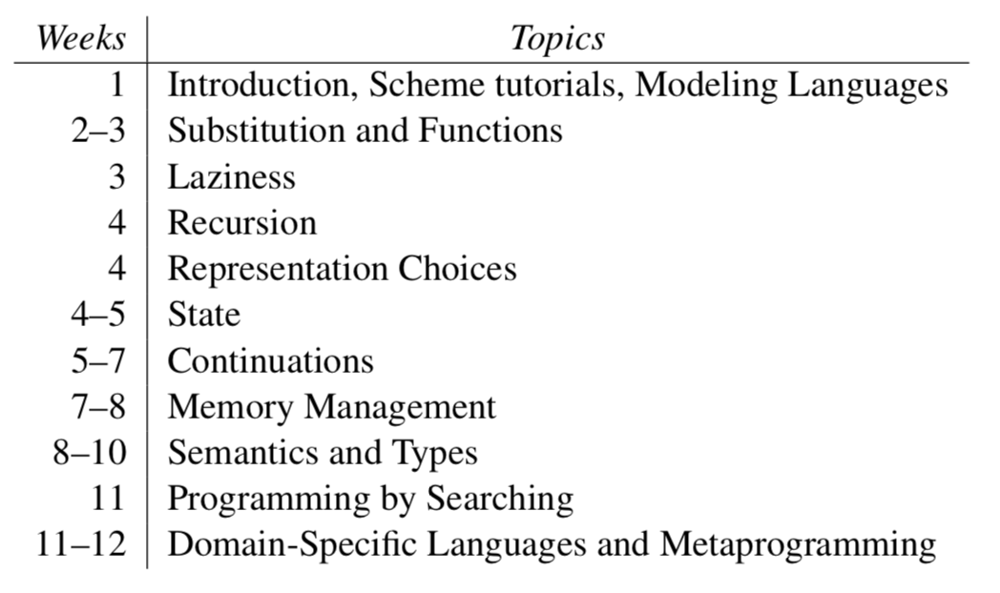

### Reading Post-Lecture 1
#### (Preface and Prelude - Chapter 1)

##### (Preface)
- Pedagogical approach: a combination of language study and interpreter study. Program with some features first, then **"distill those principles into an interpreter".**
-   Some excercises provided by the author are available at http://www.cs.brown.edu/courses/cs173/2019/
- Course 'schedule' per the text:

##### (Prelude - Chapter 1)
###### Modeling Languages
- Most laguages consist of
    - a peculiar syntax
    - some behaviour associated with different combinations of symbols in the syntax
    - many external and included libraries
    a collections of **idoms** that programmers use
- In a scholarly context, Syntax, Libaries, and Idioms are less meaningful. **Syntax** can vary wildly from language to language but produce the same result. **Libraries** can be distracting and it can be 'mathematically' shown that the core of any language exists before libraries are taken into consideration. (This line is fairly grey but the point remains). Lastly, idioms are inherently human constructs and can sometimes even carry faulty elements of understanding or habit.
- For our purposes, we are primarily concerned with **Semantics** in other words, what does the syntax of a language acutally MEAN.

###### 1.1 Modeling Meaning
- Need a descriptive language that is more precise than regular human language and less cumbersome/advanced than formal math and logic.
- We use a cousing of operational semantics called **interpreter** sementics.
- "To explain a language, write an interpreter for it"
-  Obviously the language we use for description is itself defined by some semantics, but for our purposes we assume that others have sufficiently defined those semantics (in much the same way that an english dictionary seems to avoid this problem)

###### 1.2 Modeling Syntax
Example: adding two numbers might appear as
```
3 + 4 (infix)
```
or 
```
3 4 + (postfix)
```
or
```
(+ 3 4) (parenthesized prefix)
```
Which all mean essentially the same thing, apply the operation defined by ```+``` (typically adding) to the two values ("idealized numbers") represented by 3 and 4. 

The essence of the expression can be though of as a tree with addition as the root and the two input numbers as leaves. The Scheme representation is
```scheme
(add(num 3)(num 4))
```
Similarly,
```
(3-4) + 7
```
is represented in Scheme as
``` scheme
(add (sub (num 3) (num 4)) 
    (num 7))
```
Pseudocode data definition to support these:
```
(define-type AE 
    [num (n number?)] 
    [add (lhs AE?)
         (rhs AE?)] 
    [sub (lhs AE?)
         (rhs AE?)])
```
where ```AE``` means "Arithmetic Expression"

The ```rhs``` and ```lhs``` expressions are of type ```AE``` so as to support nested expressions. If they were of type ```num```, then an expression like ``` (3-4) + 7 ``` would be rejected since ```(3+4)``` is acutally and ```AE```, not a ```num```.

###### 1.3 Primer on Parsers
- Our **interpreter** will consume **terms** of type AE so as to ignore the precise syntax of the language. To automate the constuction of these types, we create a program called a **parser**.
- Per the text, a parser (formally) is "a program that converts **concrete syntax** (what the user might type) into **abstract syntax**".
- There are really three phases of translastion from concrete to abstract syntax: tokenizing, reading, and parsing.
- The **read** or (**quote**) primitive: effectively encapsulates the first two of these steps, producing from a raw input string and producing an **s-expression** (symbolic expression) value.
-Example
    ``` scheme
    (quote {+ 1 2})
    ```
    Outputs:
    ``` scheme
    '(+ 1 2)
    ```
- To provide a clear specification of concrete syntax, we use BNF descriptions that look like
    ```
    <AE> ::= <num>
        | {+ <AE> <AE>}
        | {- <AE> <AE>}
    ```
    where the ```<>``` indicate a **non-terminal** identifier i.e. one that can be defined 'recursively'. Everything not enclosed in ```<>``` is literal syntax.
- The BNF representation encapsulates the concrete syntax and much of the abstract syntax as well. The only thing missing is to assign names to the fields.
