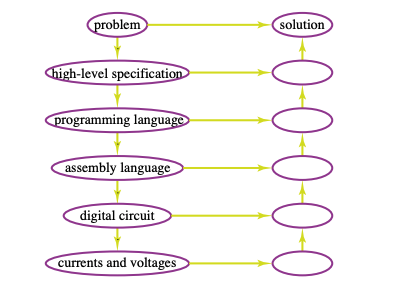

### Code and Notes from First Day of Class (Sept. 4th, 2019)
#### (And Subsequent Reading Notes)

#### Course Logistics
- Course Site: http://www.cs.ubc.ca/~poole/cs312/2019/
- Assignment 1 is due Thursday Sept. 12th

#### What is function and logic programming?
- Program is a high-level specification of **what** should be computed, not **how** it should be computed.
- Try to find representations that are as close to the problem **domain** as possible
- Abstract away from the state of a computer
- Programming and debugging should all be questions about the **domain**, not about the **computation**.
- Allow computer to decide how to most efficiently implement the program.
- To solve a complex problem, break it into simpler problems.
- Variables cannot change their values. Controlled side effects.
- Haskell is a **strongly typed** language. You don’t need to declare types. Type checking is done at **compile time**.

**We need to represent a problem to solve it on a computer.**

problem → specification of problem → appropriate computation

#### Hierarchy of Representation


``` haskell

-- CPSC 312 - 2019 - Our First Haskell Program
-- To run this program, do:
-- ghci
-- :load First

module First where

x = y+3
y = 10

-- y now holds the value ten
-- x contains y + 3 (from the y value determined at the time of loading this file)


-- PREFIX OPERATORS:
--  name made up of letters, digits, ’ or _ and start with a
-- lower-case letter

square :: Double -> Double      -- type declaration
square x = x*x

-- returns the square of the input
-- e.g.
-- >> square 2
-- 4.0

fourth x = square (square x)

-- try:
-- :type fourth --> RESULT: 
--    fourth :: Double -> Double

-- NOTE: we have to use the parentheses because the prefix operator
-- 'square' has highest precedence and is bound from left to right
-- Entering
-- >> square square 2
-- Results in in the following error:
-- 
-- <interactive>:9:1: error:
--     • Couldn't match expected type ‘Integer -> t’
--                   with actual type ‘Double’
--     • The function ‘square’ is applied to two arguments,
--       but its type ‘Double -> Double’ has only one
--       In the expression: square square 2
--       In an equation for ‘it’: it = square square 2
--     • Relevant bindings include it :: t (bound at <interactive>:9:1)

-- <interactive>:9:8: error:
--     • Couldn't match expected type ‘Double’
--                   with actual type ‘Double -> Double’
--     • Probable cause: ‘square’ is applied to too few arguments
--       In the first argument of ‘square’, namely ‘square’
--       In the expression: square square 2
--       In an equation for ‘it’: it = square square 2


-- INFIX OPERATORS
--  name made up of sequences of other characters

x %^&*$ y = 100000*x+y

-- :type %^&*$ --> RESULT: ERROR! why?
--
-- >> 2 %^&*$ 3
--  200003

double x = x*2
-- :type double --> double :: Num a => a -> a
-- Num: numerical type (any int, double, complex etc.)

foo x y = 1000*x+y

-- try:
-- foo 9 3      --> 9003
-- foo(9,3)     --> ERROR
-- (foo 9) 3    --> 9003
-- :type foo    --> foo :: Num a => a -> a -> a
-- :type (9,3)  --> (9,3) :: (Num a, Num b) => (a, b)
-- :type foo 9  --> foo 9 :: Num a => a -> a


-- 100 / 7                          --> 14.285714285714286
-- div 100 7                        --> 14 'Integer version' of /
-- div 100.0 7                      --> Error
-- 100 `div` 7                      --> 14 (Conversion to infix)
-- (/) 100 7                        -->  14.285714285714286 (Conversion to prefix)
-- :type div 100 7                  --> div 100 7 :: Integral a => a
-- :type 1.5                        --> 1.5 :: Fractional p => p
-- (div 100 7) + 1.5                --> ERROR (types?)
-- fromIntegral (div 100 7) + 1.5   --> 15.5
-- [Equivalent to (fromIntegral (div 100 7)) + 1.5]
-- fromIntegral :: (Integral a, Num b) => a -> b


-- fac n returns n!
fac 0 = 1
fac n = n * fac (n-1)


-- fib n  returns the nth fibonacci number
fib :: Int -> Int
fib 0 = 1
fib 1 = 1
fib n = fib (n-1) + fib (n-2)
-- try:
-- fib 30 --> takes too long


-- fib1 n  returns the nth fibonacci number
fib1 0 = 1
fib1 n = fib2 (n-1) 1 1 

-- fib2 n f0 f1 where f0 and f1 are subsequent fibonacci number returns the
--  nth fibonacci number after f1
fib2 0 f0 f1 = f1
fib2 n f0 f1 = fib2 (n-1) f1 (f0+f1)

--fib1 1000
--fib1 10000

-- absol n  returns the absolute value of n
absol n
   | n >= 0    = n
   | otherwise = -n

-- otherwise :: Bool
-- otherwise just holds the value True


-- length [3,5,2,9]
-- :type length
-- product [3,5,2,9]
-- :type product

factorial n = product [1..n]

average ns = sum ns `div` length ns

-- let myave ns = sum ns / length ns

-- myave ns = sum ns / fromIntegral (length ns)


plus1 x = x+1
plus x y= x+y
pls(x,y) = x+y

ff f x = f (f x)

-- Try:
-- ff plus1 5
-- ff (plus 6) 1
-- ff (+ 6) 1
-- ff (* 10) 2

fourthnew = ff square

--- Infix operators
x ++++ y = 1000*x+y

-- 7 ++++ 3
-- (++++) 7 3
-- (7 ++++) 3
-- ((++++) 7) 3
-- (++++ 7) 3
-- ff (++++ 7) 4
-- ff (7 ++++) 4
-- ff ((++++) 7) 4
-- (* 7) `ff` 2

qsort [] = []
qsort (x:xs) = qsort smaller ++ [x] ++ qsort larger
     where
         smaller = [e | e <- xs, e <= x]
         larger = [e | e <- xs, e > x]

-- Try:
-- qsort [5,4,8,1,9,4,7]

```

#### Some More Haskell Basics:
- ``` = ``` used for definitions
- ``` | ``` for conditional definition
- ``` :: ``` for type declarations
- ``` -- ``` comment to end of line or ``` {- comment -} ```
- indentation is significant (less strict than python)
- parentheses are used for precedence and tuples (not for arguments of functions)
- Function application binds most strongly
    ``` haskell factorial 3*5 ``` means ``` (factorial 3)*5 ```
- Binary prefix functions can be made infix using back-quotes, e.g. ``` ‘div‘```
- Infix operators can be made prefix using parentheses, e.g. ```(*)```

#### Readings:
Thompson Sections 1.1, 1.2, 1.4, 1.5, 1.7, 1.8, 1.9, 1.10, 1.11, 2.1-2.7

##### Notes:
###### (Preface)
- Functional programming provides a high level perspective that encourages safety and robustness.
- FP languages are GP but provide toolkits for creating DSLs
- In FP, ideas of modern programming are presented as clearly as possible
- FP allows us to **think differently** about programming and often help us see a wider space of possibilities for our code.
- FP functions are simple to deconstruct and evaluate mathematically, resulting in the **Random testing** and **proof** properties being much more practical than in other languages (imperative, OO)
###### (1.1 Computers and Modeling)
- Programming can be seen as the task of **modelling** real or imaginary situations using the hardware of a computer (different **paradigms** provide different tools for accomplishing this).
###### (1.2 What is a function?)
- Gives and **output** value given one (zero?) or more **input** values. 
- In FP, we focus on **values**, often numeric quantities, and the functions which "work over them".
###### (1.4 Types)
- There are different kinds of values, and specific **groupings** of values based on properties (they are the same "sort" of value) are known as types.
- A type dicates how and if a function can act on the values of that type (if it is defined and how it is defined for a given type).
###### (1.5 Haskell)
- Named after Haskell B. Curry, an early contributer in the subject know as the **lambda calculus**
- Many **implementations**, including **GHCi** (Glasgow Haskell Compiler interactive) which we will be using and which is part of the **Haskell Platform**.
- There is a package manager software callled **cabal**.
###### (1.7 Definitions)
- Haskell programs consist of **definitions**, which associate a **name** (identifier) with a value of some **type**, e.g.
    ```haskell
    name :: type
    name = expression
    ```
    or more specifically
    ```haskell
    size :: Integer
    size = 12 + 13
    ```
- ``` :: ``` can be read as "is a/is an", i.e. "size is an Integer".
- Note that the case convention uses capitals for type names.
- Finally, in evaluating an expression, we can replace any identifier with the associated value, for example
    ``` haskell
    size - 17
    ```
    Can be evaluated as
    ``` haskell
    (12 + 13) - 17
    ```
    or even further as just
    ``` haskell
    8
    ```
###### (1.8 Function Definitions)
- A function to square an ```Integer```
    ``` haskell
    square :: Integer -> Integer
    square n = n * n
    ```
    The symbol 
    ``` haskell 
    -> 
    ``` 
    Indicates that this is a function, so the expression is equivalent to:
    - "square is a function that takes an Integer to and Integer"

    The second line defines the result of the function given the inputs and means that when ```square``` is applied to some arbitary integer ``` n ```, the result is ``` n * n```. This holds whatever the value of ```n``` is.

###### (1.9 Types and FP)
- Types on functions provide:
    1) constraints on how a function can be applied
    2) what the type of the result will be if the function is correctly applied.

    They also provide the possibility of type-checking to automatically tell if a function is being used correctly. Type-check errors are caught before any expressions or programs are evaluated.

###### (1.10 Calculation and Evaluation)
- A nice characteristic of FP is that evaluation by replacing expressions with their definitions is a **complete description** of computation in Haskell. We call these step-by-step evaluations **calculations**.
    e.g.
    ``` haskell
    23 - (double (3 + 1))       
    ~> 23 - (2 * (3+1))         using (dbl)
    ~> 23 - (2 * 4)             arithmetic
    ~> 23 - 8                   arithmetic
    ~> 15                       arithmetic
    ```
    *Sometimes it is also convenient to undeline which part of the previous expression is modified to the next one.

###### (1.11 The Essence of Haskell Programming)
- How are **variables** in Haskell different from imperative/OO languages?
    - A **Java** variable is like a box, storing a value, whose contents can be changed by making an asignment. Furthermore, methods can change state and result in **side-effects**.
    - **Haskell** variables don't vary, and programs in Haskell are more of a description of the **relationships between input and output data**
- Other aspects of Haskell:
    - Functions can be passed around just like any other data
    - Haskell functions do not have side effects in the context of a program, but of course there are libraries available to interact with and modify files, network resources, etc. (See **mondads**).
    - Programs are easy to **paralellize**
    - Definitions that are equations express **properties** of programs, and lead to straighforward proofs about computation.
    - Easier to refactor and modify as problem specs change
